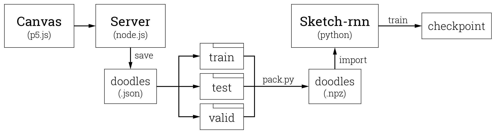

# Pictographic Reality 象形实境

Here are the tools I developed for creating my own doodle dataset for [Sketch-RNN](https://magenta.tensorflow.org/sketch-rnn-demo) by Google Magenta.

## Workflow Pipeline

## Author

* **Giada Sun** - Graduate Student in Video & Media Design at [Carnegil Mellon University](https://www.cmu.edu/) - [Website](http://giadasun.com)
